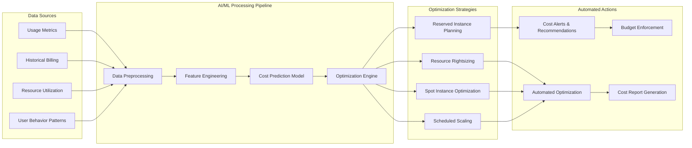
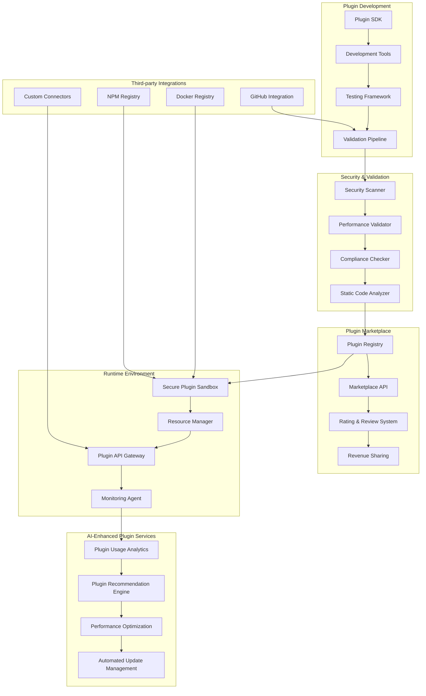
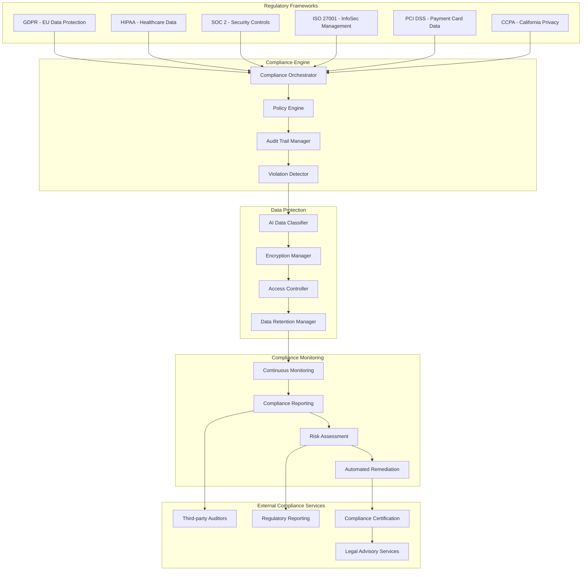

# Enhanced AI-Native PaaS Architecture for Future-Proofing

## Architecture Enhancements Overview

This document outlines the enhanced architecture components that future-proof the AI-native PaaS platform for enterprise needs, emerging technologies, and evolving market requirements.

## Enhanced Multi-Region Architecture

### Global Distribution Strategy

```mermaid
graph TB
    %% Global Infrastructure
    subgraph "Global Edge Network"
        CloudFront[AWS CloudFront]
        GlobalAccelerator[AWS Global Accelerator]
        EdgeLocations[Edge Locations Worldwide]
    end
    
    %% Regional Clusters
    subgraph "Primary Region - US East"
        USEast[US East Control Plane]
        USEastData[US East Data Plane]
        USEastAI[US East AI/ML Services]
    end
    
    subgraph "Secondary Region - EU West"
        EUWest[EU West Control Plane]
        EUWestData[EU West Data Plane]
        EUWestAI[EU West AI/ML Services]
    end
    
    subgraph "Tertiary Region - Asia Pacific"
        APSouth[AP South Control Plane]
        APSouthData[AP South Data Plane]
        APSouthAI[AP South AI/ML Services]
    end
    
    %% Cross-Region Services
    subgraph "Cross-Region Coordination"
        GlobalEventBus[Global Event Bus]
        CrossRegionReplication[Cross-Region Replication]
        GlobalStateManager[Global State Manager]
        RegionFailover[Automated Region Failover]
    end
    
    %% Data Residency & Compliance
    subgraph "Compliance & Data Residency"
        GDPRCompliance[GDPR Compliance Engine]
        DataClassification[Data Classification Service]
        ResidencyEnforcement[Data Residency Enforcement]
        ComplianceReporting[Compliance Reporting]
    end
    
    %% Intelligent Routing
    subgraph "Intelligent Traffic Management"
        LatencyOptimizer[Latency-based Routing]
        CostOptimizer[Cost-aware Load Balancing]
        ComplianceRouter[Compliance-aware Routing]
        PerformanceAnalyzer[Real-time Performance Analysis]
    end
    
    %% Connections
    CloudFront --> EdgeLocations
    GlobalAccelerator --> LatencyOptimizer
    
    LatencyOptimizer --> USEast
    LatencyOptimizer --> EUWest
    LatencyOptimizer --> APSouth
    
    USEast --> GlobalEventBus
    EUWest --> GlobalEventBus
    APSouth --> GlobalEventBus
    
    GlobalEventBus --> CrossRegionReplication
    CrossRegionReplication --> GlobalStateManager
    
    DataClassification --> GDPRCompliance
    GDPRCompliance --> ResidencyEnforcement
    ResidencyEnforcement --> ComplianceRouter
    
    PerformanceAnalyzer --> CostOptimizer
    CostOptimizer --> ComplianceRouter
```



### Multi-Region Failover Strategy

#### Automated Failover Mechanisms
```python
# Pseudo-code for intelligent failover logic
class RegionFailoverManager:
    """
    Manages automated failover between regions with AI-driven decision making.
    Considers factors like latency, cost, compliance, and resource availability.
    """
    
    def __init__(self):
        self.health_checker = RegionHealthChecker()
        self.ai_predictor = FailoverPredictor()  # SageMaker-based predictor
        self.compliance_checker = ComplianceValidator()
        
    def evaluate_failover_decision(self, primary_region: str, 
                                 secondary_regions: List[str]) -> FailoverDecision:
        """
        AI-driven failover decision making based on multiple factors:
        - Region health and performance metrics
        - Compliance and data residency requirements
        - Cost implications of failover
        - Predicted recovery time for primary region
        """
        
        # Collect real-time metrics from all regions
        region_metrics = self.health_checker.get_region_metrics(
            [primary_region] + secondary_regions
        )
        
        # AI-powered prediction of optimal failover target
        failover_prediction = self.ai_predictor.predict_optimal_failover(
            primary_region=primary_region,
            candidate_regions=secondary_regions,
            current_metrics=region_metrics,
            historical_patterns=self.get_historical_patterns()
        )
        
        # Validate compliance requirements for each candidate region
        compliant_regions = self.compliance_checker.filter_compliant_regions(
            candidate_regions=secondary_regions,
            data_classification=self.get_data_classification(),
            regulatory_requirements=self.get_regulatory_requirements()
        )
        
        # Make final decision considering all factors
        return self.make_failover_decision(
            prediction=failover_prediction,
            compliant_regions=compliant_regions,
            cost_implications=self.calculate_cost_impact(secondary_regions)
        )
```

#### Latency Optimization
- **Edge Computing Integration**: Deploy compute resources closer to users
- **Intelligent Caching**: AI-driven cache placement and invalidation strategies
- **Network Path Optimization**: Dynamic routing based on real-time network conditions
- **Predictive Pre-positioning**: Move resources based on predicted demand patterns

## Advanced AI-Driven Optimizations

### Cost Prediction and Optimization Engine



### User Pattern Adaptation System

#### Behavioral Learning Engine
```python
class UserBehaviorLearningEngine:
    """
    Advanced user behavior analysis and adaptation system using multiple AI services.
    Learns from user interactions to optimize platform experience and resource allocation.
    """
    
    def __init__(self):
        self.comprehend_client = boto3.client('comprehend')
        self.sagemaker_client = boto3.client('sagemaker')
        self.personalize_client = boto3.client('personalize')
        
    def analyze_user_patterns(self, user_interactions: List[UserInteraction]) -> UserBehaviorProfile:
        """
        Comprehensive user behavior analysis using multiple AI services:
        - Natural language processing for user feedback and support tickets
        - Time series analysis for usage patterns
        - Anomaly detection for unusual behavior
        - Personalization for customized experiences
        """
        
        # Process user feedback and support interactions
        sentiment_analysis = self.analyze_user_sentiment(user_interactions)
        
        # Identify usage patterns and trends
        usage_patterns = self.extract_usage_patterns(user_interactions)
        
        # Detect anomalies in user behavior
        anomalies = self.detect_behavioral_anomalies(user_interactions)
        
        # Generate personalized recommendations
        recommendations = self.generate_personalized_recommendations(
            user_interactions, usage_patterns
        )
        
        return UserBehaviorProfile(
            sentiment_score=sentiment_analysis.sentiment_score,
            usage_patterns=usage_patterns,
            anomalies=anomalies,
            recommendations=recommendations,
            confidence_score=self.calculate_confidence_score(user_interactions)
        )
    
    def adapt_platform_configuration(self, behavior_profile: UserBehaviorProfile) -> ConfigurationChanges:
        """
        Automatically adapt platform configuration based on learned user behavior:
        - Adjust resource allocation based on usage patterns
        - Customize UI/UX based on user preferences
        - Optimize performance for user-specific workloads
        - Proactively address potential issues
        """
        
        configuration_changes = ConfigurationChanges()
        
        # Resource allocation optimization
        if behavior_profile.usage_patterns.peak_hours:
            configuration_changes.add_scheduled_scaling(
                scale_up_time=behavior_profile.usage_patterns.peak_start,
                scale_down_time=behavior_profile.usage_patterns.peak_end,
                scaling_factor=behavior_profile.usage_patterns.peak_intensity
            )
        
        # Performance optimization based on workload characteristics
        if behavior_profile.usage_patterns.workload_type == 'cpu_intensive':
            configuration_changes.add_instance_type_recommendation('c5.large')
        elif behavior_profile.usage_patterns.workload_type == 'memory_intensive':
            configuration_changes.add_instance_type_recommendation('r5.large')
        
        # Proactive issue prevention
        if behavior_profile.anomalies:
            configuration_changes.add_monitoring_enhancement(
                metrics=behavior_profile.anomalies.related_metrics,
                alert_thresholds=behavior_profile.anomalies.suggested_thresholds
            )
        
        return configuration_changes
```

## Enhanced Plugin System Architecture

### Advanced Plugin Ecosystem



### Dynamic Plugin Loading System
```python
class DynamicPluginManager:
    """
    Advanced plugin management system with AI-driven optimization and security.
    Supports hot-loading, version management, and intelligent resource allocation.
    """
    
    def __init__(self):
        self.security_validator = PluginSecurityValidator()
        self.performance_monitor = PluginPerformanceMonitor()
        self.ai_optimizer = PluginAIOptimizer()
        self.resource_manager = PluginResourceManager()
        
    def load_plugin(self, plugin_manifest: PluginManifest) -> PluginLoadResult:
        """
        Intelligent plugin loading with comprehensive validation and optimization:
        - Security validation and sandboxing
        - Performance impact assessment
        - Resource allocation optimization
        - Compatibility verification
        """
        
        # Comprehensive security validation
        security_result = self.security_validator.validate_plugin(plugin_manifest)
        if not security_result.is_safe:
            return PluginLoadResult.security_failure(security_result.violations)
        
        # Performance impact assessment
        performance_impact = self.performance_monitor.assess_impact(plugin_manifest)
        if performance_impact.risk_level > PerformanceRiskLevel.ACCEPTABLE:
            return PluginLoadResult.performance_risk(performance_impact.details)
        
        # AI-driven resource allocation
        optimal_resources = self.ai_optimizer.calculate_optimal_resources(
            plugin_manifest=plugin_manifest,
            current_system_load=self.get_current_system_load(),
            historical_performance=self.get_plugin_performance_history(plugin_manifest.id)
        )
        
        # Allocate resources and create sandbox
        sandbox = self.resource_manager.create_sandbox(
            plugin_id=plugin_manifest.id,
            resource_allocation=optimal_resources,
            security_constraints=security_result.constraints
        )
        
        # Load plugin in sandbox with monitoring
        try:
            plugin_instance = sandbox.load_plugin(plugin_manifest)
            self.performance_monitor.start_monitoring(plugin_instance)
            
            return PluginLoadResult.success(
                plugin_instance=plugin_instance,
                resource_allocation=optimal_resources,
                monitoring_config=self.performance_monitor.get_config(plugin_instance)
            )
            
        except Exception as e:
            sandbox.cleanup()
            return PluginLoadResult.load_failure(str(e))
    
    def optimize_plugin_performance(self, plugin_id: str) -> OptimizationResult:
        """
        AI-driven plugin performance optimization based on usage patterns and metrics:
        - Resource allocation adjustment
        - Caching strategy optimization
        - API call pattern optimization
        - Memory usage optimization
        """
        
        # Collect performance metrics and usage patterns
        metrics = self.performance_monitor.get_plugin_metrics(plugin_id)
        usage_patterns = self.ai_optimizer.analyze_usage_patterns(plugin_id)
        
        # Generate optimization recommendations
        optimizations = self.ai_optimizer.generate_optimizations(
            current_metrics=metrics,
            usage_patterns=usage_patterns,
            system_constraints=self.get_system_constraints()
        )
        
        # Apply safe optimizations automatically
        applied_optimizations = []
        for optimization in optimizations:
            if optimization.safety_score > 0.8:  # High confidence optimizations
                result = self.apply_optimization(plugin_id, optimization)
                if result.success:
                    applied_optimizations.append(optimization)
        
        return OptimizationResult(
            plugin_id=plugin_id,
            applied_optimizations=applied_optimizations,
            pending_optimizations=[o for o in optimizations if o.safety_score <= 0.8],
            performance_improvement=self.calculate_performance_improvement(plugin_id)
        )
```

## Comprehensive Compliance Framework

### Multi-Regulatory Compliance Engine



### Error Learning and System Improvement

#### Advanced Error Learning Engine
```python
class AdvancedErrorLearningEngine:
    """
    Sophisticated error learning system that continuously improves platform reliability
    through pattern recognition, root cause analysis, and automated remediation.
    """
    
    def __init__(self):
        self.pattern_recognizer = ErrorPatternRecognizer()
        self.root_cause_analyzer = RootCauseAnalyzer()
        self.remediation_engine = AutomatedRemediationEngine()
        self.knowledge_base = ErrorKnowledgeBase()
        
    def learn_from_error(self, error_event: ErrorEvent) -> LearningResult:
        """
        Comprehensive error learning process:
        - Pattern recognition and classification
        - Root cause analysis using AI/ML
        - Solution recommendation and validation
        - Knowledge base update and sharing
        """
        
        # Classify error and identify patterns
        error_classification = self.pattern_recognizer.classify_error(error_event)
        similar_errors = self.knowledge_base.find_similar_errors(error_classification)
        
        # Perform root cause analysis
        root_cause_analysis = self.root_cause_analyzer.analyze(
            error_event=error_event,
            similar_errors=similar_errors,
            system_context=self.get_system_context(error_event.timestamp)
        )
        
        # Generate and validate remediation strategies
        remediation_strategies = self.remediation_engine.generate_strategies(
            error_classification=error_classification,
            root_cause=root_cause_analysis.primary_cause,
            system_constraints=self.get_system_constraints()
        )
        
        # Validate strategies using simulation
        validated_strategies = []
        for strategy in remediation_strategies:
            validation_result = self.simulate_remediation(strategy, error_event)
            if validation_result.success_probability > 0.8:
                validated_strategies.append(strategy)
        
        # Update knowledge base with new learning
        knowledge_update = self.knowledge_base.update(
            error_event=error_event,
            classification=error_classification,
            root_cause=root_cause_analysis,
            remediation_strategies=validated_strategies
        )
        
        return LearningResult(
            error_id=error_event.id,
            classification=error_classification,
            root_cause=root_cause_analysis,
            recommended_actions=validated_strategies,
            knowledge_base_update=knowledge_update,
            confidence_score=self.calculate_confidence_score(error_event, root_cause_analysis)
        )
    
    def proactive_issue_prevention(self) -> PreventionResult:
        """
        Proactive issue prevention based on learned patterns and predictive analytics:
        - Identify potential failure scenarios
        - Implement preventive measures
        - Monitor effectiveness of prevention strategies
        - Continuously refine prevention models
        """
        
        # Analyze current system state for potential issues
        potential_issues = self.pattern_recognizer.predict_potential_issues(
            current_metrics=self.get_current_system_metrics(),
            historical_patterns=self.knowledge_base.get_failure_patterns(),
            environmental_factors=self.get_environmental_factors()
        )
        
        # Generate preventive measures for high-risk scenarios
        preventive_measures = []
        for issue in potential_issues:
            if issue.risk_score > 0.7:  # High risk threshold
                measures = self.remediation_engine.generate_preventive_measures(issue)
                preventive_measures.extend(measures)
        
        # Implement safe preventive measures automatically
        implemented_measures = []
        for measure in preventive_measures:
            if measure.safety_score > 0.9:  # Very high confidence
                implementation_result = self.implement_preventive_measure(measure)
                if implementation_result.success:
                    implemented_measures.append(measure)
        
        return PreventionResult(
            potential_issues_identified=len(potential_issues),
            preventive_measures_generated=len(preventive_measures),
            measures_implemented=len(implemented_measures),
            risk_reduction_estimate=self.calculate_risk_reduction(implemented_measures)
        )
```

## AWS Well-Architected Framework Alignment

### Operational Excellence
- **Infrastructure as Code**: Complete CDK/Terraform automation
- **Automated Operations**: AI-driven operational procedures
- **Continuous Improvement**: Learning-based system evolution
- **Operational Metrics**: Comprehensive operational dashboards

### Security
- **Defense in Depth**: Multi-layered security architecture
- **Identity and Access Management**: Fine-grained RBAC implementation
- **Data Protection**: Comprehensive encryption and classification
- **Incident Response**: Automated security incident handling

### Reliability
- **Fault Tolerance**: Multi-region active-active architecture
- **Recovery Procedures**: Automated disaster recovery
- **Change Management**: AI-assisted change impact analysis
- **Monitoring and Alerting**: Predictive monitoring and alerting

### Performance Efficiency
- **Resource Optimization**: AI-driven resource allocation
- **Performance Monitoring**: Real-time performance analytics
- **Scalability**: Predictive and reactive scaling strategies
- **Technology Selection**: Data-driven technology choices

### Cost Optimization
- **Cost-Aware Architecture**: Built-in cost optimization
- **Resource Rightsizing**: AI-powered resource recommendations
- **Usage Monitoring**: Detailed cost attribution and tracking
- **Reserved Capacity**: Intelligent reserved instance planning

### Sustainability
- **Carbon Footprint Optimization**: Green computing practices
- **Resource Efficiency**: Minimize resource waste
- **Renewable Energy**: Preference for renewable energy regions
- **Lifecycle Management**: Efficient resource lifecycle management

This enhanced architecture provides a comprehensive, future-proof foundation that addresses enterprise requirements, emerging technologies, and evolving market needs while maintaining alignment with AWS best practices and industry standards.
